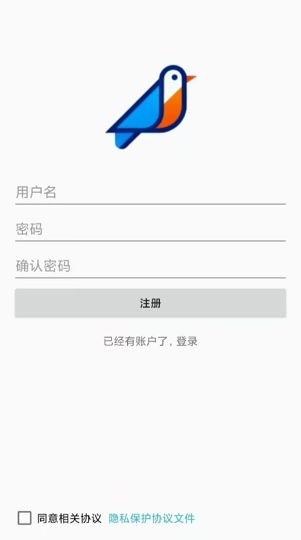
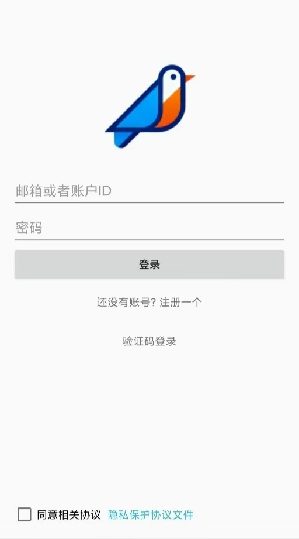
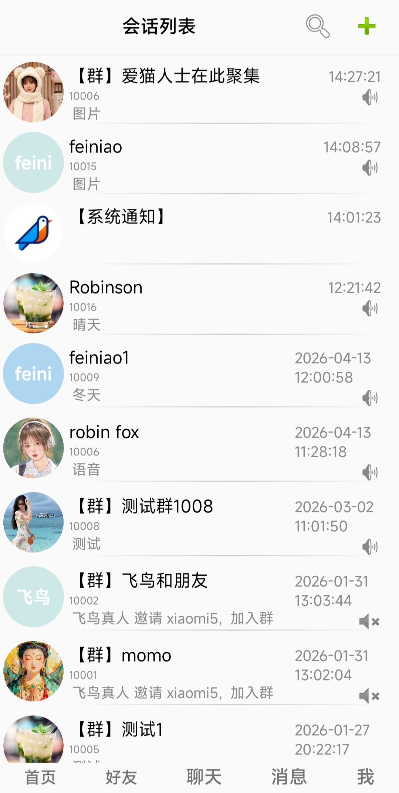
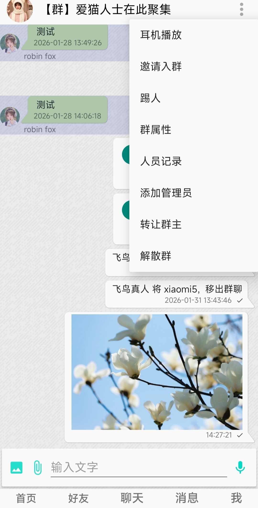

# 欢迎使用 鸣聊 软件 安卓版
# 1. 简介


这是一款开源的即时通信软件的安卓版本客户端。
[服务端代码仓库]: https://github.com/robinfoxnan/BirdTalkServer


**DEMO App内部使用了组件BirdTalk SDK；**

**SDK集成了聊天的基础功能，App集成SDK实现相关功能。**

**目前的功能与特点如下：**

- SDK内置聊天界面，简洁易上手；
- SDK封装聊天相关功能，方便二次开发；
- SDK与后端使用websocket加密通信；
- SDK使用DF密钥交换认证，免登录；
- SDK支持文本、图片、语音、附件形式消息；
- 支持私聊和群聊；
- 群聊支持多种加入方式；
- 后端服务为单程序，部署容易；
- 后端设计支持多终端登录；
- 后端使用scyllaDb、mongoDb、Redis存储数据，方便扩展；

# 2. 编译apk

使用android studio 2024版本。

其中，需要在源码中设置服务器地址：

打开`WebSocketClient.kt`

```kotlin
    private var serverPath: String = "wss://192.168.1.2:7817/ws?"
    private var fileServerPath: String = "https://192.168.1.2:7817"
```

两个参数，第一个是web socket的连接地址，第二个是文件下载的地址前缀，这里的地址和端口都是一样，为了将来扩展使用了2个参数；


# 3. 功能说明

## 3.1 注册与登录

1）匿名注册：填写一个用户名，设置密码，后台服务会分配一个唯一数字作为账号，

注册完成后自动登录。

2）手动登录：如果之前有账号，可以填写账号数字和密码登录；

|      |  |
| ---- | ------------------------------------------- |


3）邮箱注册：填写一个邮箱地址，等待验证码，填写验证码后点注册，后台服务会分配一个唯一数字作为账号，

注册完成后自动登录。


## 3.2 搜索好友

在底部点"好友"，顶部点“搜索”，左侧按钮是搜人，右侧按钮是搜群；

用户双向关注，也就是“互关”就算好友，可以互相发消息；

1）使用账号精确查找；

2）使用关键字模糊搜索；


## 3.3 关注与粉丝

粉丝和关注列表中默认动态更新；

## 3.4 私聊

在“互关”界面，点“发消息”可以进入发送消息界面；

1）消息支持文本、图片、语音和附件；

2）消息如果是时钟则是发送中；如果是惊叹号则是失败；一个√就是提交服务器；2个√就是送到对方了；

如果是绿色的√就是对方阅读了消息；


## 3.5 群聊

1）在会话列表中，右侧的“加号”可以添加一个群；

2）进入群后，在顶部右侧“...”进入群相关的设置；

3）目前支持基础功能：群成员拉人进群，以及管理员踢人；

4）其中群的个别功能未实现：转让群主，人员操作记录，申请加入群以及通过问题进去群；

| 会话列表                                        | 群设置菜单                                       |
| ----------------------------------------------- | ------------------------------------------------ |
|  |  |


# 4. 后续

1）完成群相关其他功能；

2）服务端支持集群扩展；


**联系方式QQ&WX：390017268**
